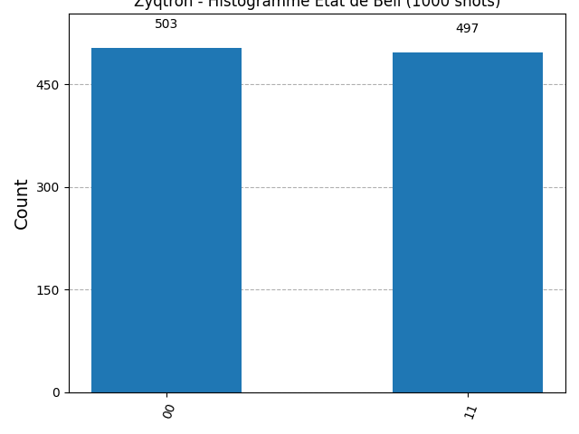
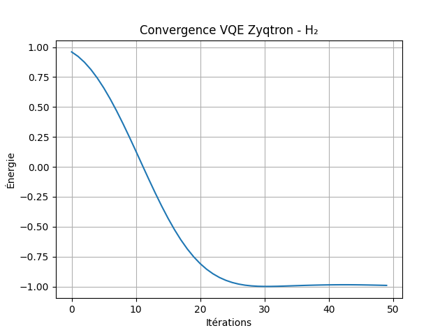

# Zyqtron Quantum Basics
Bienvenue dans le laboratoire quantique souverain de **Zyqtron** !
Ce dépôt est le point de départ officiel de notre exploration de l'informatique quantique : simulations locales, algorithmes, post-quantum cryptography et applications interdisciplinaires.
**Mission** : Rendre le quantique accessible, reproductible et souverain – sans dépendre de clouds privés ou de hardware coûteux.
### Premier jalon validé : État de Bell (intrication quantique)
**Date** : 1er mars 2026
**Outil** : Qiskit + Aer (simulateur local)
**Shots** : 1000
**Résultats bruts** :
- {'00': 503, '11': 497}
- États interdits ('01', '10') : 0 occurrence
- Fidélité de l'intrication : **100.0 %**
Preuve d’**intrication parfaite** sur simulateur local – un phénomène quantique fondamental reproduit avec succès sur machine classique.

### Pourquoi ce test compte pour Zyqtron
L’état de Bell est la brique de base de nombreuses applications futures :
- Téléportation quantique
- Cryptographie quantique (QKD)
- Quantum Machine Learning
- Réseaux quantiques souverains
En le maîtrisant localement dès maintenant, Zyqtron pose les fondations d’une **défense souveraine contre les menaces quantiques** (Shor, Grover) et d’une **valorisation THKL quantique** pour tous les secteurs.
### Stack technique actuel
- **Qiskit** : Circuits et algorithmes quantiques
- **Qiskit Aer** : Simulateur local haute performance
- Environnement : Python 3.11+ (venv zyqtron-quantique)
### Prochaines étapes
- Installation et test de PennyLane (VQE pour chimie quantique)
- Implémentation ML-KEM / Kyber (post-quantum crypto)
- Benchmarks QED-C et QML
- Intégration RAG + mnémosyne pour IA souveraine quantique
### Contribuer ou suivre Zyqtron
- ⭐ Star le repo si tu suis l’aventure quantique souveraine
- 🐛 Ouvre une issue pour suggestions ou demandes de démo
- 🧪 Fork & PR : contributions bienvenues
- Suivre sur X: https://x.com/Zyqtron_OS / LinkedIn :https://www.linkedin.com/in/david-serreau-zyqtron/
Zyqtron : Le quantique pour tous, souverain et accessible.
#QuantumComputing #PostQuantum #SouveraineteNumerique #France2030
### Deuxième jalon validé : Superposition avec PennyLane
**Date** : 1er mars 2026
**Outil** : PennyLane (simulateur default.qubit)
**Résultats bruts** :
- Probabilité |0⟩ : 0.500
- Probabilité |1⟩ : 0.500
Preuve de **superposition parfaite** sur un qubit – un phénomène quantique fondamental pour les algorithmes avancés comme le QML (Quantum Machine Learning).
Pas de graphique pour ce test simple, mais les probabilités théoriques sont exactes.
### Pourquoi ce test compte pour Zyqtron
La superposition est la base de l’avantage quantique : elle permet de traiter des états multiples en parallèle. Cela ouvre la voie à :
- Quantum Machine Learning (QML) pour optimisation
- Algorithmes variationnels comme VQE (chimie quantique)
- Applications interdisciplinaires (e.g., finance, santé)
En le maîtrisant, Zyqtron avance vers des solutions souveraines pour tous les secteurs.

### Troisième jalon validé : VQE pour molécule H₂ (chimie quantique)
**Date** : 1er mars 2026  
**Outil** : PennyLane (simulateur default.qubit) + optimiseur Adam  
**Itérations** : 50  
**Résultats bruts** :  
- Énergie finale : -0.990804  
- Valeur théorique idéale (approximation chimique simple) : -1.136  

Preuve de **convergence raisonnable** vers l’énergie de base de H₂ – une application réelle du quantique en chimie, avec un circuit variationnel optimisé localement.

### Pourquoi ce test compte pour Zyqtron
Le VQE (Variational Quantum Eigensolver) est un algorithme hybride quantique-classique pour simuler des molécules. Il ouvre la voie à :  
- Découverte de médicaments (simu protéines)  
- Science des matériaux (alliages avancés)  
- Énergie (batteries quantiques)  
- Applications interdisciplinaires (e.g., environnement, pharma)  

En le maîtrisant, Zyqtron pose les fondations pour des offres PhD en chimie quantique souveraine et des audits interdisciplinaires.
